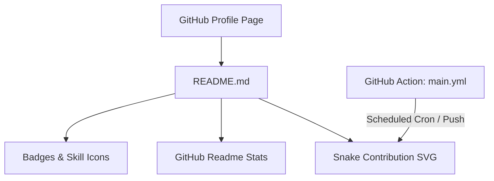

# Architecture Overview

## Structural Overview
The repository serves as a special GitHub Profile README repository (`Omprakash-p06/Omprakash-p06`). When rendered on GitHub, `README.md` is displayed on the user's main GitHub profile page (`https://github.com/Omprakash-p06`).

## Data Flow & Lifecycle
1. **User Visits Profile**: GitHub renders `README.md`.
2. **Third-Party Assets**: Images are fetched dynamically via HTTP from external SVG servers.
3. **Snake Contribution**:
   - Workflow runs daily on schedule (`0 0 * * *`) or on push.
   - Generates `github-contribution-grid-snake.svg`.
   - Commits and pushes output to the `output` branch.
